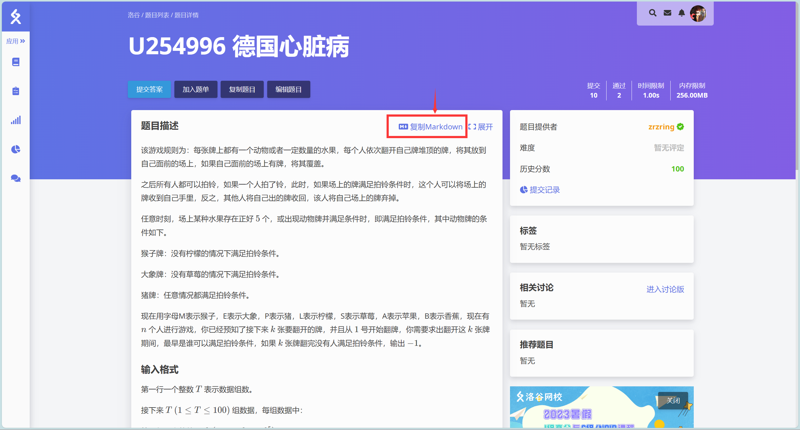

# 一、准备工作

本地先建立好一个题目的工作区，其中需要以下文件：

> `problem.md`：题面，可以直接使用洛谷复制出的md文件。
> `solution.md`：题解，详细叙述题目的解答思路及解答过程。
> `std.cpp`：标程，多种做法可以标号。
> `data.cpp`：数据生成器，多个生成器可以标号。
> `*.in`：输入数据，扩展名满足条件即可，文件名可以暗含一些信息，也可以直接简单标号。
> `*.out`：输入数据，扩展名满足条件即可，文件名一定要与对应输入文件相同。

### 题面

推荐使用洛谷书写题面，注意 **题目背景** 并不需要，可留空。

登录洛谷主页 https://www.luogu.com.cn ，进入个人主页，点击题库，这里存放所有自己的题目，点击创建题目就可以开始写题面了。

学习 LaTeX 和 Markdown 语法，书写题面必备。

写完之后将 Markdown 源码复制到本地 `problem.md` 文件中。



### 数据

使用文件操作：

```C++
freopen("1.in", "r", stdin);
freopen("1.out", "w", stdout);
```

上述代码可以将同目录下的 `1.in` 进行读入，将输出结果输出到 `1.out` 中。

同理，我们可以新建一个数据生成器，插入以下代码：

```cpp
freopen("1.in", "w", stdout);
```

即将程序输出结果输出到 `1.in`。

在后面的文件操作命令可以覆盖之前的文件操作命令。

如果想用循环生成多个数据，并且对文件操作的文件名进行标号，需要使用 `string` 类型的 `c_str()` 函数将 `string` 类型转化成 `const char *` 类型使用。

随机数生成方法，首先需要引用万能头文件，之后再代码里插入以下代码。

```C++
std::random_device RD;
std::mt19937_64 gen(RD());
int64 roll(int64 l, int64 r) {std::uniform_int_distribution<int64> dist(l, r); return dist(gen);}
```

此时可以调用 `roll(x, y)` 来生成一个 `long long` 值域内在 $[x, y]$ 区间的随机数。

# 二、题面规范

题面应该遵守国家政策和法律法规，不得出现敏感信息。

### 题目描述

题面表述应该精简、流畅、清晰，避免歧义，尽可能地易于理解。

针对一些不常见或有歧义的概念，需要适当地给出解释，确保读者理解题目要求。

题面应该尽可能地详细，最好使用形式化语言，避免留下歧义和疑惑。

### 输入格式

对每个数据需要标注该数据的类型与取值范围。

数据范围必须有上界和下界的描述，字符串必须有字符集的描述，实数必须有小数点后位数的描述。

当有效位数较少时，大于等于 $10^5$ 的数应使用科学计数法。其中乘号应使用 $\times$，其 LaTeX 公式为 `\times`

不同变量的数据范围应分开为多个公式，公式与公式之间用全角逗号隔开。若存在多个变量的数据范围相同，可合并为同一个公式。

### 输出格式

若答案需要取模，最好在题目描述和输出格式中两次说明，其中输出格式中必须说明。

### 提示

包括样例说明、出题人、验题人。如果该题分工更加明晰，比如数据，题面，标程，题解不是一个人的工作，建议都列出来。至少需要出题人和验题人两个不同的人。

### 其他事项

SparkOJ 支持直接拖拽图片，如果是互联网上的图片，建议保存到本地再拖拽到题面里，这样可以在 SparkOJ上存一份图片，提升访问速度。

一些符号和格式的使用细节：

- 句末要有句号（或问号、感叹号）。

- 数学公式（运算式、运算符、参与运算的常数、作为变量的字母等）应使用 $LaTeX$，非数学公式（一般英文单词、题目名、算法名、人名等）不使用 $LaTeX$。

- 公式内部使用英文标点符号，公式外部使用中文标点符号。

- 汉字与英文字符，公式，数字，代码块之间以空格隔开。

- 代码格式的操作命令，特定的字符串，应用行内代码块表示。

# 三、数据规范

数据应该具有较高的质量，保证简单的暴力算法无法通过。

建议给出各种各样的边界数据，以测试算法的正确性。

一种合理的生成数据的方法为对小数据的枚举，可以充分卡掉不正确的做法。

题目时限应该至少是标程运行时间的 1.5 倍，以充分考虑算法的运行时间和效率。